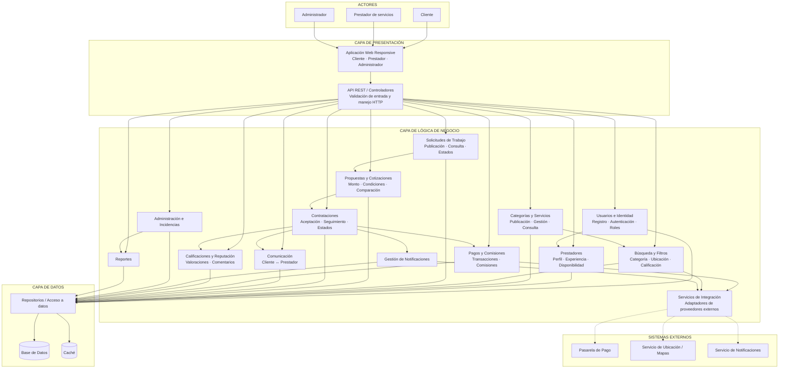

# Arquitectura inicial del sistema

## 1. Descripción general

La plataforma digital para la oferta, búsqueda y contratación de servicios técnicos, profesionales y de oficios en Ayacucho se organizará inicialmente mediante una **arquitectura en tres capas**:

1. Capa de Presentación.
2. Capa de Lógica de Negocio.
3. Capa de Datos.

Adicionalmente, la solución se integrará con servicios externos para el procesamiento de pagos, ubicación geográfica y envío de notificaciones.

El objetivo de esta organización es separar responsabilidades, reducir el acoplamiento entre componentes y facilitar el mantenimiento y evolución futura del sistema.

---

## 2. Principios de diseño

La arquitectura inicial seguirá los siguientes principios:

- La interfaz de usuario no accederá directamente a la base de datos.
- Las reglas de negocio se concentrarán en la capa de lógica de negocio.
- El acceso a la información se realizará mediante componentes especializados.
- Los sistemas externos se consumirán mediante servicios de integración.
- Los módulos deberán mantener responsabilidades claramente definidas.
- Las dependencias seguirán una dirección controlada entre capas.
- La base de datos será la fuente principal de información persistente.
- La caché se utilizará únicamente como apoyo para mejorar el rendimiento cuando sea necesario.

---

## 3. Capa de Presentación

### Responsabilidad

La capa de presentación será responsable de gestionar la interacción entre los usuarios y la plataforma.

Permitirá recibir solicitudes, mostrar información, validar formatos básicos de entrada y comunicarse con la lógica de negocio mediante la API REST.

### Componentes

- Aplicación web responsive.
- Vistas del cliente.
- Vistas del prestador de servicios.
- Panel de administración.
- API REST.
- Controladores.
- Validación de datos de entrada.

### Actores que interactúan con esta capa

- Cliente.
- Prestador de servicios.
- Administrador.

### Regla principal

La capa de presentación no deberá contener reglas importantes del negocio ni acceder directamente a la base de datos.

---

## 4. Capa de Lógica de Negocio

### Responsabilidad

La capa de lógica de negocio constituye el núcleo funcional del sistema.

Será responsable de ejecutar los casos de uso, aplicar las reglas del negocio, coordinar el acceso a datos y comunicarse con los servicios externos cuando sea necesario.

### Módulos principales

#### 4.1. Usuarios e identidad

Responsable de:

- Registro de usuarios.
- Autenticación.
- Recuperación de cuenta.
- Gestión de roles.
- Gestión de permisos.
- Actualización de perfiles.

#### 4.2. Prestadores

Responsable de:

- Perfil profesional.
- Experiencia.
- Especialidades.
- Disponibilidad.
- Evidencias de trabajos realizados.
- Reputación del prestador.

#### 4.3. Categorías y servicios

Responsable de:

- Categorías.
- Subcategorías.
- Publicación de servicios.
- Edición de servicios.
- Activación y desactivación.
- Consulta de servicios disponibles.

#### 4.4. Búsqueda

Responsable de:

- Búsqueda de servicios.
- Búsqueda de prestadores.
- Filtrado por categoría.
- Filtrado por ubicación.
- Filtrado por disponibilidad.
- Filtrado por calificación.

#### 4.5. Solicitudes de trabajo

Responsable de:

- Publicación de trabajos.
- Consulta de trabajos disponibles.
- Gestión del estado de las solicitudes.
- Asociación de categoría y ubicación.

#### 4.6. Propuestas y cotizaciones

Responsable de:

- Envío de propuestas.
- Registro de monto.
- Registro de condiciones.
- Consulta de propuestas.
- Comparación de propuestas.
- Aceptación o rechazo.

#### 4.7. Contrataciones

Responsable de:

- Crear la contratación después de aceptar una propuesta.
- Gestionar los participantes de la contratación.
- Controlar los estados del trabajo.
- Registrar inicio, ejecución, finalización o cancelación.
- Mantener la trazabilidad del servicio.

#### 4.8. Comunicación

Responsable de:

- Comunicación entre cliente y prestador.
- Asociación de mensajes con una contratación o propuesta.
- Consulta del historial de comunicación.

#### 4.9. Pagos y comisiones

Responsable de:

- Registrar pagos.
- Solicitar operaciones a la pasarela externa.
- Recibir confirmaciones de pago.
- Gestionar estados de transacción.
- Calcular comisiones de la plataforma.

#### 4.10. Calificaciones y reputación

Responsable de:

- Registrar calificaciones.
- Registrar comentarios.
- Validar que el servicio esté finalizado antes de calificar.
- Actualizar información de reputación del prestador.

#### 4.11. Notificaciones

Responsable de generar eventos relacionados con:

- Nuevas propuestas.
- Propuestas aceptadas.
- Cambios de estado.
- Pagos.
- Finalización del servicio.
- Incidencias relevantes.

#### 4.12. Administración

Responsable de:

- Gestión de usuarios.
- Gestión de categorías.
- Moderación de publicaciones.
- Gestión de denuncias.
- Gestión de incidencias.
- Supervisión de operaciones.
- Parámetros generales de la plataforma.

#### 4.13. Reportes

Responsable de generar información sobre:

- Usuarios.
- Prestadores.
- Servicios.
- Solicitudes.
- Contrataciones.
- Pagos.
- Comisiones.
- Incidencias.

---

## 5. Capa de Datos

### Responsabilidad

La capa de datos será responsable de almacenar, consultar, actualizar y recuperar la información necesaria para el funcionamiento del sistema.

### Componentes

- Repositorios.
- Base de datos.
- Mecanismo de caché.

### Información principal almacenada

- Usuarios.
- Roles.
- Perfiles.
- Prestadores.
- Categorías.
- Subcategorías.
- Servicios.
- Solicitudes.
- Propuestas.
- Contrataciones.
- Estados.
- Pagos.
- Comisiones.
- Calificaciones.
- Comentarios.
- Notificaciones.
- Incidencias.
- Reportes.
- Historial de operaciones.

### Base de datos

La base de datos será la fuente principal de información persistente del sistema.

### Caché

La caché podrá utilizarse para mejorar el rendimiento de consultas frecuentes, por ejemplo:

- Categorías.
- Servicios más consultados.
- Resultados de búsquedas frecuentes.
- Información pública de prestadores.

La caché no reemplazará a la base de datos como fuente principal de información.

---

## 6. Sistemas externos

Los sistemas externos permanecerán fuera de las tres capas principales.

### 6.1. Pasarela de pago

Permitirá:

- Procesar pagos.
- Consultar estados de transacción.
- Confirmar operaciones.
- Gestionar respuestas y errores del proveedor.

### 6.2. Servicio de ubicación / mapas

Permitirá:

- Obtener referencias geográficas.
- Apoyar búsquedas por ubicación.
- Mostrar zonas o referencias en mapas.

### 6.3. Servicio de notificaciones

Permitirá enviar avisos mediante mecanismos externos relacionados con eventos importantes de la plataforma.

---

## 7. Flujo general de una operación

Un flujo típico dentro de la arquitectura será el siguiente:

1. El usuario realiza una acción desde la aplicación web.
2. La aplicación web envía una solicitud a la API REST.
3. El controlador recibe y valida los datos básicos.
4. La solicitud se envía al caso de uso correspondiente.
5. La lógica de negocio aplica las reglas necesarias.
6. Si requiere información, utiliza un repositorio.
7. El repositorio consulta o modifica la base de datos.
8. Si la operación requiere un servicio externo, la lógica de negocio utiliza un servicio de integración.
9. El resultado regresa a la API REST.
10. La aplicación web muestra la respuesta al usuario.

---

## 8. Diagrama de arquitectura



---

## 9. Interpretación del diagrama

Los actores acceden únicamente mediante la aplicación web responsive.

La aplicación web utiliza una API REST como punto de entrada al backend.

La API REST delega las solicitudes a los módulos correspondientes de la lógica de negocio.

La lógica de negocio concentra las reglas y casos de uso de la plataforma, evitando que estas reglas sean implementadas directamente en la interfaz o en la base de datos.

Los módulos de negocio utilizan repositorios para acceder a la información persistente.

La base de datos mantiene la información principal del sistema, mientras que la caché puede utilizarse para optimizar determinadas consultas frecuentes.

Las integraciones externas se realizan mediante servicios especializados, evitando que los módulos principales dependan directamente de proveedores específicos.

---

## 10. Reglas de dependencia

La arquitectura debe respetar las siguientes reglas:

```text
ACTORES
   ↓
PRESENTACIÓN
   ↓
LÓGICA DE NEGOCIO
   ↓
DATOS
```

No se permitirá:

```text
Presentación → Base de datos directamente
```

Tampoco se recomienda:

```text
Interfaz → Pasarela de pago directamente
```

La comunicación deberá realizarse mediante:

```text
Presentación
     ↓
Lógica de negocio
     ↓
Servicios de integración
     ↓
Proveedor externo
```

---

## 11. Relación con los drivers arquitectónicos

La arquitectura propuesta responde a los principales drivers identificados.

| Driver | Decisión arquitectónica relacionada |
|---|---|
| DA01 - Escalabilidad | Separación de responsabilidades y organización modular que permitirá evolucionar los componentes. |
| DA02 - Rendimiento | Repositorios, optimización de consultas y utilización controlada de caché. |
| DA03 - Seguridad | Gestión centralizada de autenticación, roles y permisos. |
| DA04 - Pasarela de pago | Servicio de integración independiente del proveedor externo. |
| DA05 - API REST | Separación entre aplicación web y backend mediante una interfaz HTTP definida. |
| DA06 - Resiliencia | Integraciones externas desacopladas para reducir el impacto de fallas secundarias. |
| DA07 - Mantenibilidad | Módulos con responsabilidades claramente definidas y dependencias controladas. |

---

## 12. Decisiones arquitectónicas iniciales

Se establecen las siguientes decisiones para esta primera versión:

- Se utilizará una arquitectura en tres capas.
- La aplicación cliente será una aplicación web responsive.
- La comunicación con el backend se realizará mediante API REST.
- Las reglas del negocio permanecerán en la capa de lógica de negocio.
- El acceso a datos se realizará mediante repositorios.
- La base de datos será la fuente principal de persistencia.
- La caché se utilizará únicamente como mecanismo de optimización.
- Los servicios externos estarán aislados mediante componentes de integración.
- La arquitectura permitirá posteriormente incorporar otros clientes, como una aplicación móvil, reutilizando el backend.
- La arquitectura inicial podrá evolucionar posteriormente dentro del SDD a medida que se definan decisiones arquitectónicas más específicas.

---

## 13. Conclusión

La arquitectura inicial propuesta organiza la plataforma de servicios en tres capas claramente diferenciadas y establece responsabilidades, dependencias e integraciones controladas.

Esta estructura permite mantener separadas la interfaz, las reglas del negocio y la persistencia, al mismo tiempo que prepara al sistema para integrar servicios externos, crecer progresivamente y evolucionar hacia una arquitectura más detallada en etapas posteriores del proyecto.